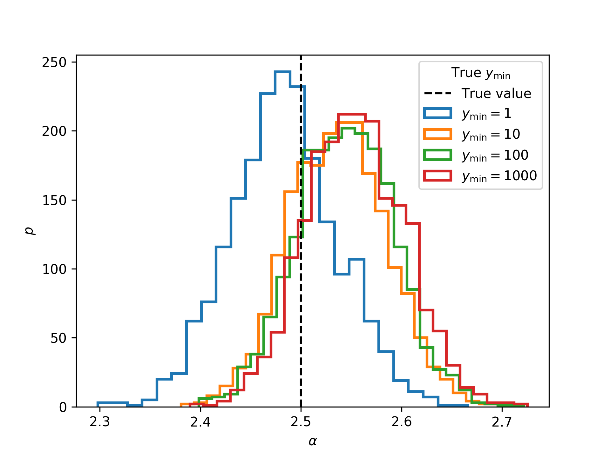
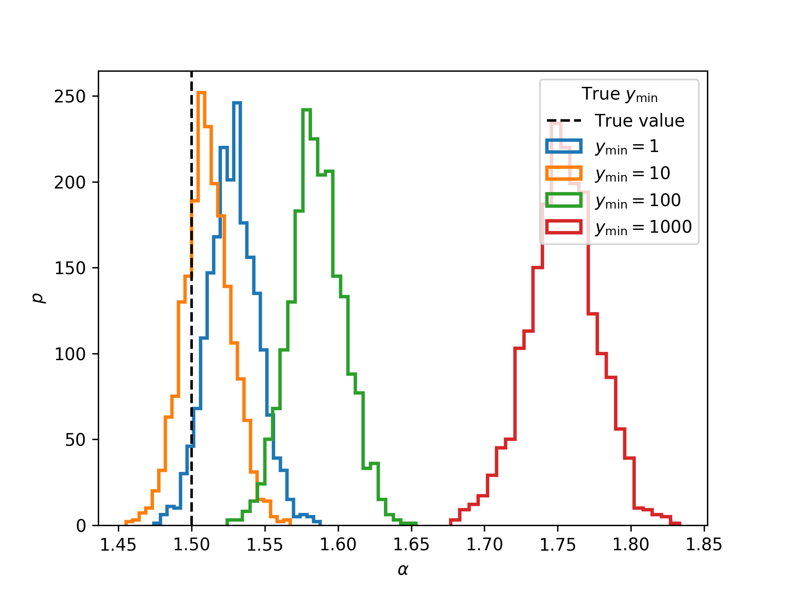
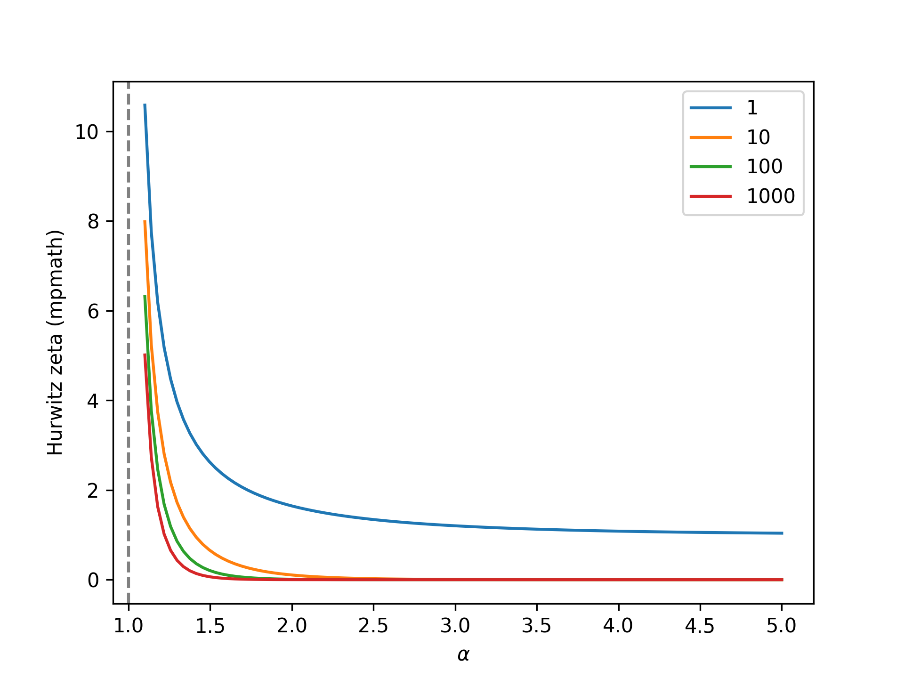
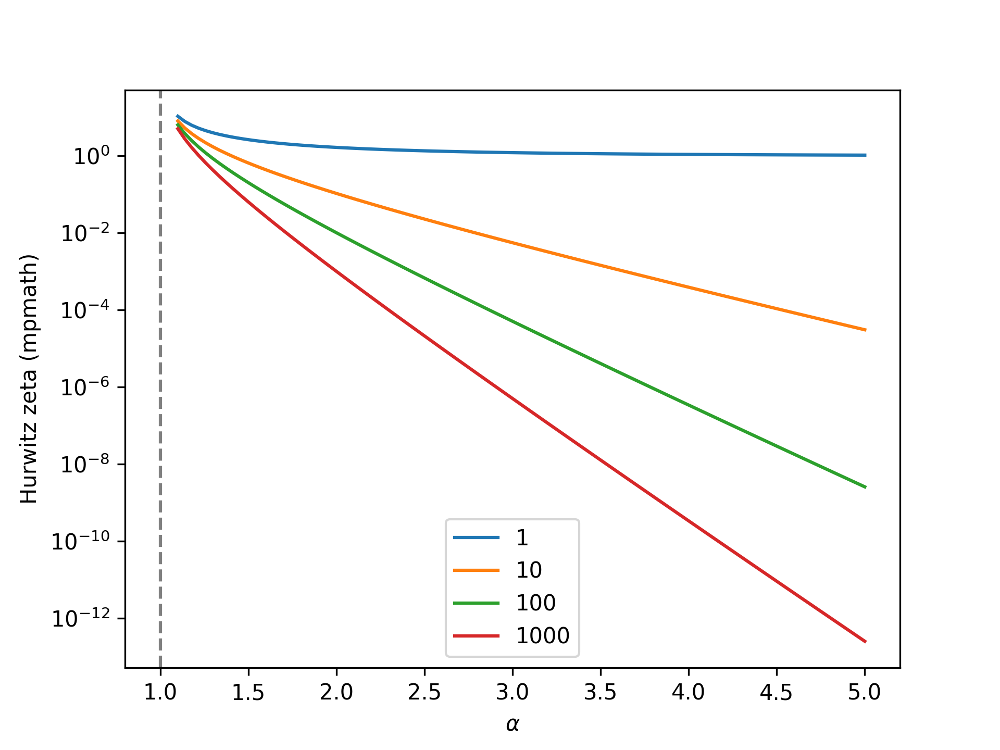
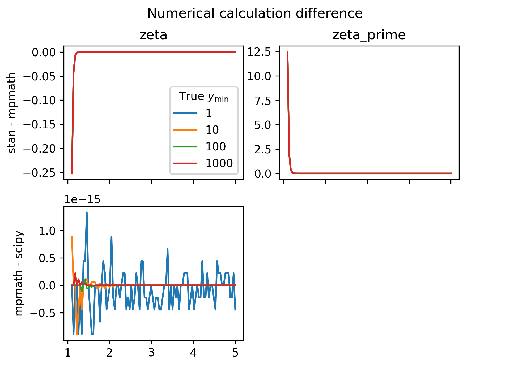
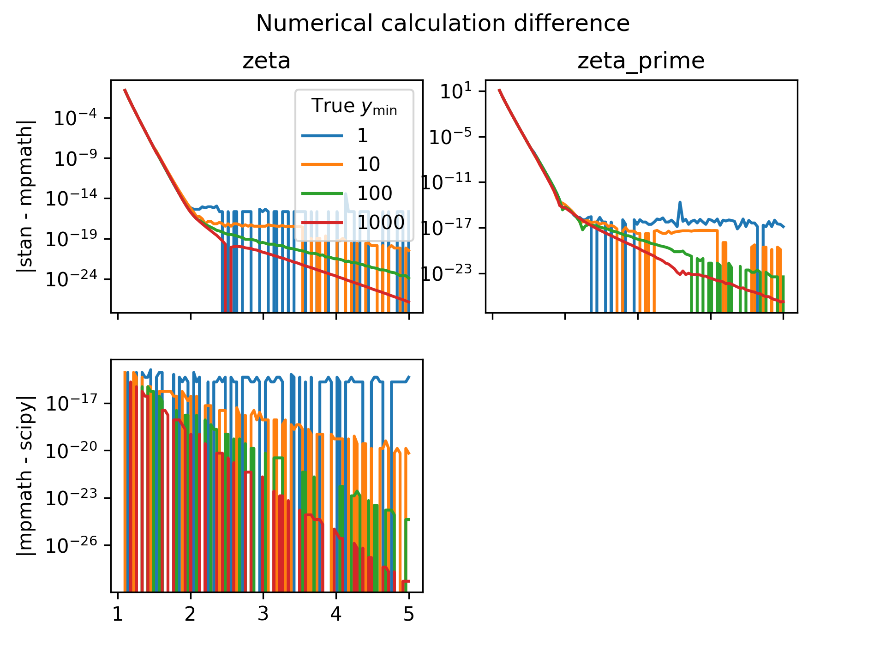

# Implementation of a discrete power law model with variable y_min value in stan

This example code demonstrates Bayesian inference with a discrete outcome power law distribution (AKA the [discrete Pareto or  Zipf](https://en.wikipedia.org/wiki/Zipf's_law#Related_laws) distribution) where the minimum value, , is allowed to vary. This is accomplished using [*Stan*](https://mc-stan.org) via calculation of the Hurwitz zeta function using custom external C++ functions.

Credit belongs to [maxbiostat](https://github.com/maxbiostat) for *Stan* and C++ code and R implementation.

Note that the input data format for the *Stan* model is a frequency table (a list of values and a list of counts at each value) rather than raw discrete samples.  The modeling is equivalent, but this input format facilitates the marginalization over discrete parameters necessary for *Stan* (and highly efficient).

## Dependencies

The minimal working example implemented in R (zipf_mwe_varying_Ymin.r) and the tests for the Hurwitz zeta implementation in C++ (as called through *Stan*) require *rstan* (v.2.19.3).

The inference test suite and comparison to reference implementations of the Hurwitz zeta in python (discrete_power_law_testing.py) is written for python 3.6 and requires *numpy* (v. 1.17.0), *pystan* (v. 2.19.1.1), *scipy* (v. 1.3.0), *mpmath* (v 1.1.0), and *matplotlib* (v. 3.1.1).

## Limitations

**Note 1: This approach allows you to perform inference on  (the power law slope), but not  (the power law minimum value).** However, it does allow  to be fixed at an arbitrary value.  Performing inference on  would change the data range covered by the likelihood model at each iteration.  See e.g. work by [Clauset et al.](http://tuvalu.santafe.edu/~aaronc/powerlaws/) for alternate approaches.

**Note 2: the numerical integration approach implemented here will fail at  values <<2, especially when  is large.**  You can use the python testing code provided here to evaluate the numerical accuracy as a function of  and .

For example, see these inference results generated by this script when the true  value is set to 2.5, which is safely above the range of numerical accuracy issues.  Using the python script, we generate 1000 samples from the discrete Pareto implemented with scipy (see details below) at  and varying values of .  We then run the Stan model to infer .  The Stan samples show that the true  value is comfortably within the posterior range for  values from 1 to 1000:

However, if we decrease  to 1.5, we see that the inferred  values are incorrect, with the posterior generally biased to higher values as  increases.

The reasons why this happens have to do with the numerical approximation implemented in this code.  Implementing the discrete power law with variable  requires calculation of the [Hurwitz zeta function](https://dlmf.nist.gov/25.11#i), versus the simpler Riemann zeta function where  is fixed at 1. The Hurwitz zeta has a special value at  characterized by a sharper and sharper elbow as  increases.

In log scale:
    

This code calculates it using numerical integration over the [integral representation](https://dlmf.nist.gov/25.11#vii) via Boost quadrature routines. Note that the Boost library does not provide an implementation of the Hurwitz zeta (only Riemann). We also calculate the gradient of the Hurwitz zeta with respect to alpha using numerical integration of the derivative of the integral representation. 

We can compare to reference implementations of the Hurwitz zeta from the *scipy* and [*mpmath*](http://mpmath.org/) packages to understand the numerical accuracy of this technique.  *scipy*'s Hurwitz zeta uses the underlying [Cephes](https://www.netlib.org/cephes/) C package.  Both [mpmath](http://mpmath.org/doc/current/functions/zeta.html) and Cephes rely on the [Euler-Maclaurin](https://dlmf.nist.gov/25.11#iii) summation formula.

When we do this comparison for , we see that the numerical accuracy of the numerical integration approximation deteriorates rapidly as alpha decreases, especially at higher , reaching error of ~0.2. The numerical accuracy of the gradient follows a similar pattern.  Note that the scipy and mpmath implementations agree to numerical precision of ~1e-16.

On a log scale, we can see that the numerical error drops below ~1e-15 at , which explains why the *Stan* inference is unbiased above that threshold.

To relieve this limitation, you could integrate Cephes or another C/C++ implementation of a higher precision Hurwitz zeta directly as an external import to the Stan model.

